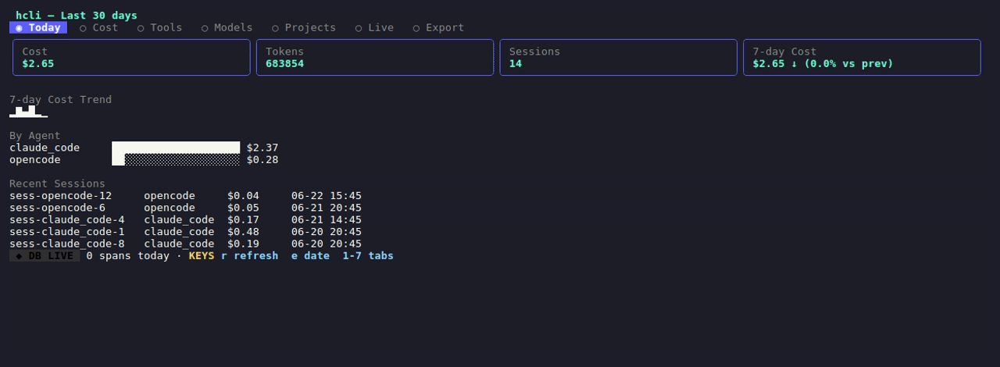
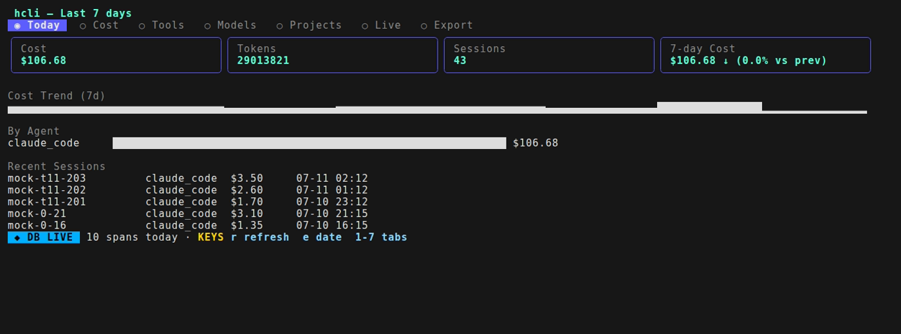
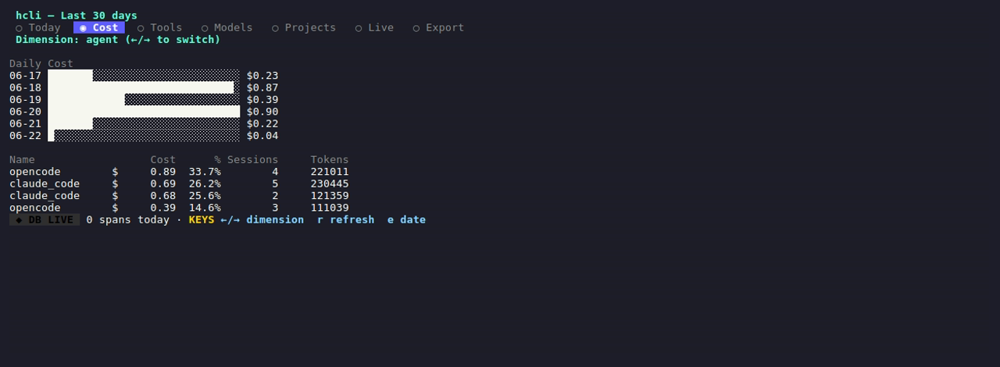
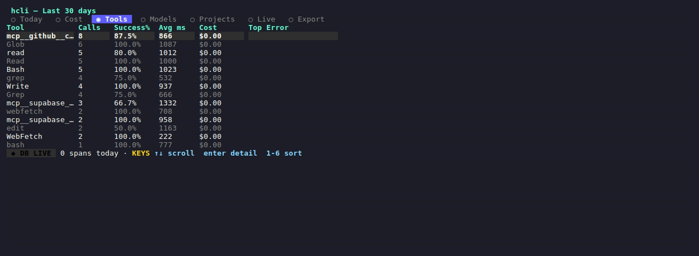
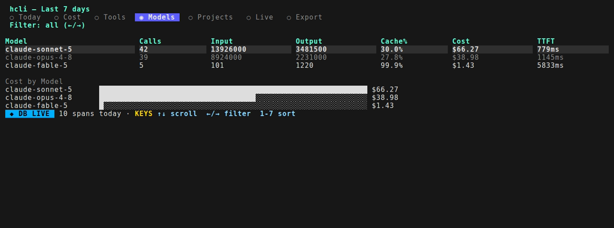
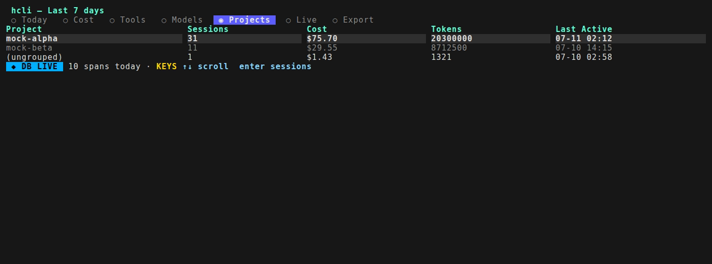

# hcli: Local-only Telemetry TUI for Coding Agents

[](https://github.com/justinmaks/hedge-local/actions/workflows/ci.yml)
[](https://github.com/justinmaks/hedge-local/releases)
[](https://pkg.go.dev/github.com/justinmaks/hedge-local)
[](LICENSE)

hcli collects OpenTelemetry (OTEL) telemetry from coding agents (Claude Code, OpenCode) into a local SQLite database and visualizes cost, tokens, tool usage, and latency in a terminal UI. Single Go binary, no cloud, no account, no telemetry home.



## Quickstart

```sh
curl -fsSL https://github.com/justinmaks/hedge-local/releases/latest/download/install.sh | sh
hcli setup claude
source ~/.hedge/env.sh
hcli
```

Start coding, and telemetry appears in the TUI within 60 seconds.

## What It Does

- **Collects** OTEL telemetry from Claude Code and OpenCode via OTLP/HTTP
- **Stores** it in a local SQLite database (WAL mode, no external services)
- **Visualizes** cost, tokens, tools, models, projects, and live activity in a 7-view TUI
- **Exports** data as CSV, JSON, or Markdown
- **Local-only**: no usage data leaves your machine

## Screenshots

> Sample data shown.

| Overview | Cost |
|----------|------|
|  |  |

| Tools | Models |
|-------|--------|
|  |  |

| Projects |
|----------|
|  |

## Install

### Shell installer (macOS + Linux)

```sh
curl -fsSL https://github.com/justinmaks/hedge-local/releases/latest/download/install.sh | sh
```

### Debian/Ubuntu (.deb)

Download the `.deb` for your architecture from the
[latest release](https://github.com/justinmaks/hedge-local/releases/latest), then:

```sh
sudo dpkg -i hcli_*_linux_amd64.deb
```

### Fedora/RHEL (.rpm)

Download the `.rpm` for your architecture from the
[latest release](https://github.com/justinmaks/hedge-local/releases/latest), then:

```sh
sudo rpm -i hcli_*_linux_amd64.rpm
```

### go install

```sh
go install github.com/justinmaks/hedge-local/cmd/hcli@latest
```

### Direct binary download

Download the archive for your platform from [GitHub Releases](https://github.com/justinmaks/hedge-local/releases), extract, and add `hcli` to your PATH.

### Uninstall

```sh
# 1. Stop the daemon if running
hcli stop

# 2. Remove the binary (location depends on how you installed)
sudo rm -f /usr/local/bin/hcli          # shell installer
rm -f "$(go env GOPATH)/bin/hcli"       # go install
# or: sudo dpkg -r hcli   /   sudo rpm -e hcli   (.deb / .rpm)

# 3. Remove local data and config (telemetry database, logs, env files)
rm -rf ~/.hedge

# 4. Remove the telemetry env line you added to your shell rc (~/.bashrc or ~/.zshrc):
#    source ~/.hedge/env.sh
```

For OpenCode, also remove `@devtheops/opencode-plugin-otel` from the `plugin`
array in your `opencode.json` if you no longer want it.

## Setup

### Claude Code

```sh
hcli setup claude
source ~/.hedge/env.sh
```

Writes OTEL env vars to `~/.hedge/env.sh`. Add `source ~/.hedge/env.sh` to your shell rc (`~/.bashrc` or `~/.zshrc`) to make it permanent.

### OpenCode

```sh
hcli setup opencode
source ~/.hedge/opencode-env.sh
```

Adds the `@devtheops/opencode-plugin-otel` plugin to your OpenCode config and writes its env vars. Source the file in the shell you run `opencode` from.

### Per-project attribution (optional)

The agents don't report which directory you're working in, so by default all
sessions land under `(ungrouped)` in the Projects view. To group by project, wrap
your agent so each run tags its working directory. Add to your shell rc
(`~/.bashrc` or `~/.zshrc`):

```sh
claude()   { OTEL_RESOURCE_ATTRIBUTES="hcli.project_path=$PWD" command claude "$@"; }
opencode() { OPENCODE_RESOURCE_ATTRIBUTES="hcli.project_path=$PWD" command opencode "$@"; }
```

Each wrapper runs the real binary (via `command`) but sets `hcli.project_path` to
your current directory, so hcli groups sessions by repo.

## Usage

### Embedded mode (zero config)

```sh
hcli
```

Starts the OTLP receiver and TUI together in one process. Press `q` to quit.

### Daemon mode

```sh
hcli collect -d       # start receiver in background
hcli tui              # open TUI (reads from DB)
hcli status           # check daemon health
hcli stop             # stop daemon
hcli logs             # tail daemon logs
hcli logs -f          # follow daemon logs
```

### Headless export

```sh
hcli export --range 7d --format csv --out ~/hcli-export.csv
hcli export --range 30d --format json --out -
hcli export --data sessions --range 7d --format markdown --out report.md
```

Flags: `--range` (today, 7d, 30d, custom:YYYY-MM-DD:YYYY-MM-DD), `--format` (csv, json, markdown), `--data` (sessions, llm_calls, tool_calls, events, weekly_report), `--out` (file path or `-` for stdout).

### SQL query (power users)

```sh
hcli query "SELECT agent, SUM(total_cost_usd) FROM sessions GROUP BY agent"
```

### Pricing management

```sh
hcli pricing list                    # list local pricing
hcli pricing import /path/to/pricing.json  # import pricing JSON
hcli pricing fetch                   # fetch latest pricing from GitHub
```

## TUI Keybindings

| Key | Action |
|-----|--------|
| `1`-`7` | Jump to tab |
| `Tab` / `Shift+Tab` | Cycle tabs |
| `e` | Date range filter |
| `r` | Refresh |
| `?` | Help |
| `q` / `Ctrl+C` | Quit |
| `↑↓` | Scroll |
| `Enter` | Focused detail |
| `Esc` | Return to table |

## Architecture

```
Agent (Claude Code / OpenCode)
  → OTLP/HTTP (port 4318)
  → Receiver (protobuf parsing)
  → Normalizer (per-agent adapter)
  → Writer (cost computation + SQLite insert)
  → TUI (Bubble Tea views reading from SQLite)
```

Single Go binary, no CGO, pure-Go SQLite via modernc.org/sqlite.

See [ARCHITECTURE.md](ARCHITECTURE.md) for component details and the
non-obvious bits, especially how cost is attributed and derived.

## Local-Only Guarantee

hcli makes **no outbound network calls** during normal operation. The only exception is `hcli pricing fetch`, which is an explicit user-initiated command that downloads pricing data from GitHub. All telemetry data stays on your machine.

Local data lives in `~/.hedge/` and is stored owner-only: the directory is created `0700` and the SQLite database and daemon logs `0600`, so other users on a shared machine can't read your captured telemetry.

## Troubleshooting

### No telemetry appearing

- Verify env vars are set: `echo $OTEL_EXPORTER_OTLP_ENDPOINT` (should be `http://localhost:4318`)
- Check daemon is running: `hcli status`
- Check daemon logs: `hcli logs`

### OpenCode: no telemetry appearing

- The telemetry env vars must be set **in the shell that launches `opencode`**.
  Run `source ~/.hedge/opencode-env.sh` in that shell (or add it to your shell
  rc). If `OPENCODE_ENABLE_TELEMETRY` is unset, the plugin stays disabled and
  sends nothing.
- Verify the `@devtheops/opencode-plugin-otel` plugin is in your `opencode.json`.
- Let the session finish normally. The plugin batches telemetry and flushes it
  on a timer / on exit; a very short `opencode run` that exits instantly can race
  the final flush. Interactive sessions and runs that do real work flush
  reliably.

### Port 4318 already in use

- Another OTLP collector may be running. Stop it or use `hcli collect --port 4319`.
- If a stale daemon is running: `hcli stop` then `hcli collect -d`.

### Database locked

- WAL mode makes this rare. If it happens, stop the daemon (`hcli stop`), wait 5 seconds, restart.

### Pricing missing

- Bundled pricing is seeded automatically by `hcli collect`. If cost shows $0, run `hcli pricing list` to verify, then `hcli pricing fetch` to update.

### Stale PID file

- If `hcli status` shows "stale PID file", run `hcli stop` to clean it up, then `hcli collect -d`.

## License

MIT
